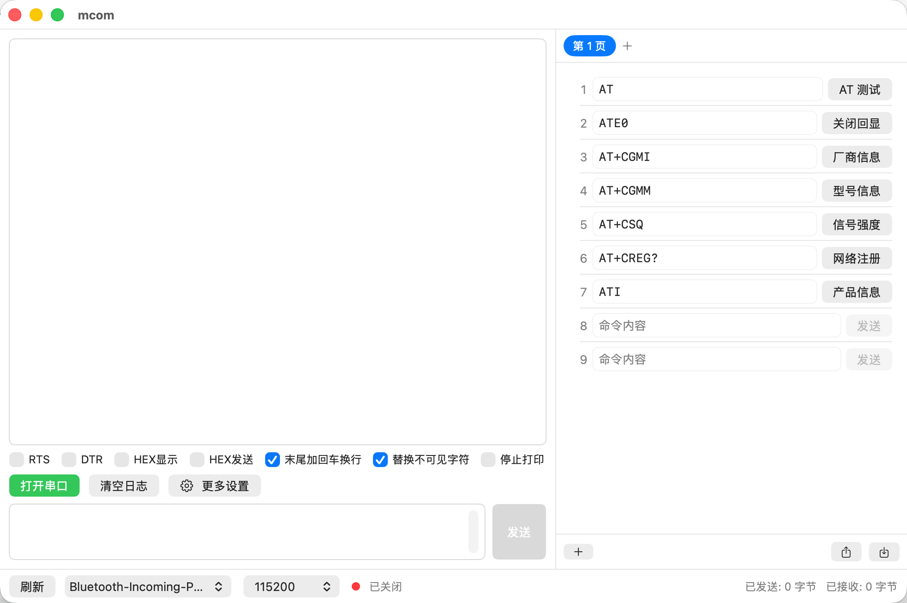

# mcom

macOS 串口调试工具，布局参考 [LLCOM](https://github.com/chenxuuu/llcom)，专为快捷发送 AT 命令设计。SwiftUI 原生实现，零第三方依赖。



  

## 功能

### 串口交互（左栏）

- **日志区**：每条消息带毫秒级时间戳和收/发标识（箭头 `←` `→` 或中文「收/发」，可在更多设置中切换），连续接收的数据自动合并，自动滚动到底部，支持选中复制
- **选项**：RTS、DTR 流控信号，HEX 显示、HEX 发送，末尾自动加 `\r\n`，替换不可见字符（`\r\n` 显示为 `␍␊` 并按 LLCOM 规则换行），停止打印（只停显示，接收计数与文件记录不受影响）
- **发送区**：多行输入框（回车换行，⌘Return 发送），支持 HEX 模式（`41 54 0D 0A`、`41540D0A`、`0x41,0x54` 等写法）
- **底部状态栏**：刷新串口、串口选择、波特率（300–2M，支持非标准波特率）、连接状态指示、已发送/已接收字节统计

### 快捷命令（右栏）

- **分页管理**：顶部胶囊页签，点击切换、`+` 添加页，右键重命名/导出/删除，选中页持久化
- **按页导入导出**：每页可导出为 JSON 文件（带版本号），导入时作为新页追加，格式错误有提示
- 点击即发送，序号 + 可直接编辑的命令输入框 + 可自定义名称的发送按钮
- `+` 直接追加空白行，右键重命名/删除，拖拽排序
- UserDefaults 持久化，内置常用 AT 命令（AT、ATE0、AT+CGMI、AT+CGMM、AT+CSQ、AT+CREG?、ATI）

### 更多设置

- 时间显示：不显示 / 时间 / 日期+时间
- 收发标识：箭头 / 中文
- 收发日志自动保存到文件（按天分文件 `mcom-yyyyMMdd.log`），目录可自定义（安全书签持久化授权），一键在 Finder 中打开日志目录

## 技术要点

- **串口底层**：POSIX termios（8N1、raw 模式），`DispatchSource` 异步读取，`ioctl` 控制 RTS/DTR，非标准波特率走 `IOSSIOSPEED`
- **设备枚举**:IOKit `IOSerialBSDClient` 枚举 `/dev/cu.*`
- **沙盒**：开启 App Sandbox + `com.apple.security.device.serial` 授权

## 构建

```bash
xcodebuild -project mcom.xcodeproj -scheme mcom -configuration Debug build
```

或直接用 Xcode 打开 `mcom.xcodeproj`，⌘R 运行。

## 要求

- macOS 26.5+
- Xcode 26+

## 开源协议

本项目基于 [GPL v3](LICENSE) 协议开源。
